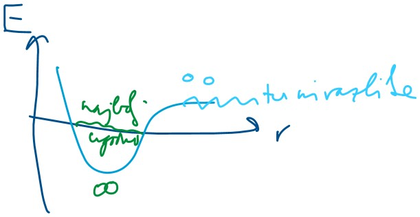

# 7. naloga
@ = atom  
\# = model  
: = ak-ostanek
. = chain

cmd: `select :146` -- označi AK-ostanek na 146. mestu

Toda ta struktura proteina je narobe številčena (na začetku ima še neke dodatke). 
Tools -> Structure Editing -> Renumber Residues

## Mutiranje
Tools -> Structure Editing -> Rotamers  
Rotamer Type: neka druga AK (npr. Arg) in se zamenja tudi ak-ostanek.  
Probability: glede na vse proteine v databazi, kateri rotameri tega ak-ostanka je najpogostejši (ne glede na našo strukturo).  

Columns -> Add -> Clashes, H-bonds  
doda 2 stolpca. Hočemo čim več H-vezi in čim manj clashov.  
Sortiramo po clashih asc. (bolj pomembno), nadalje še po H-vezeh desc.

Clashi v real-lajfu ne obstajajo. Zato se mora protein znova zviti.:

Tools -> Structure Editing -> Minimise Structure = minimizira energijo sistema; gre po metodi Monte Carlo (slepa kura 🐔), saj je stvar prezahtevna za brute-force. Koordinate vseh atomov malo zamakne (za neko naključno vrednost v naključno smer) in poračuna energijo; uporabi najbolj energijsko ugodnega (več H-vezi, manj clashov).

conjugate gradient step: 0, ker najbolj zahtevno.

Nato zopet poiščemo Clashe (pa na Clash morš kliknt, ker kontaktov je več) in dobimo 0.

Ta struktura je zdaj teoretično verjetna, ne vemo pa še, kako izgleda v naravi in kako deluje.

### Molekulska dinamika
Naredimo simulacijo, s topilom. Najprej jih na random malo premakne, nadaljnje korake pa računa glede na sile, ki so nastale zaradi spremembe. 

Tools -> MD-ansamble analysis -> MD Movie; NAMD PSF DCD, izbereš fajla iz Gabrovih zipov. To zdaj kaže, kako se protein v raztopini premika.

Match Maker pogliha proteina, če ti pobegne. (Tools -> Structure Comparison -> MatchMaker). Modri je malo bolj odprt od rjavega, saj smo namesto majhne hidrofobne ak dali veliko nabito -- porušila je hidrofobno jedro, zato se je protein rahlo razprl. 

### Razdalje
Tools -> Structure Analysis -> Distances  
C139 (SG) = cistein 139, žveplo gamma

cmd: `select #0:139@SG, select #0:276@CE1` označi gama žveplo v 139. ak v 0. modelu in še ogljik epsilon 1 v 276. ak v ničtem modelu.

Mutant ima številčeno tako, da je treba odšteti 114.

(rjavi je kao "original", čeprav smo ga mutirali, ker tisti _mininmise_ ni imel prav veliko haska. Modri je pa "mutant", saj smo simulirali še njegovo odpiranje/premikanje)

Zadnja razdalja se je premaknila iz 5 °A na 9 °A. A je to veliko? Vez je dolga ~1,neki °A, torej smo stvar zamaknili za 2 vezi => mehanizem reakcije tega ne more prežvečiti, zato ta encim slabše dela (vmes se mora encim premikati/upogibati).

# 8. naloga: morph
Ko se ligand EGF veže na receptor EGFR, pride do večjih strukturnih sprememb: 2 receptorja dimerizirata, pride do avtofosforilacije.

Odpremo 2 modela: z in brez liganda

Tools -> Depiction -> Rainbow: chain, da vidimo, koliko je vrig.

Večji temnomodri del je receptor. Ostalo (zelenkasto) je pa nekaj, kar ni naš protein, je pa pač zraven v strukturi. Sploh ni del EGFR-ja. To je "uno k daš, da lažje kristalizira" -- protitelesa (to je zgornji del IgG-ja, ki se specifično veže, da protein zadrži v 1 konformaciji). Izbrišemo: selectaš chain A v modelu #0, invertaš selection, deletaš.

Druga struktura: vezana oblika, ligand se je pripeljal, protein je dimeriziral. Ampak mi eno polovico izbrišemo. Pa ligand tudi (rdeče in rumeno). (Select chain A, invert selected model, delete)

MatchMaker. Problem: precej slabo se prilega (C-konca sta ful narazen, kar pa ni ok, saj sta s tem zasidrana v membrano).

## Iznajdljivo prileganje
cmd: `select :480-` označi od 480 do konca  
matchmaker -> further restrict matching to current selection (pri obeh) => C-konec (od 480. ak naprej) se bo prilegal, ostalo pa ne.

Končno in začetno stanje: Tools -> Structure Comparison -> Morph Conformations. Označimo oba, damo Add (odpre se majceno novo okence, gumb OK je skrit pod orodno vrstico), Create.  
Ustvari se nov model, ki je v bistvu animacija odpiranja/zapiranja. Lahko recordamo filmček.  
^ To je uporabno, če imaš začetno in končno stanje, da ni treba simulirati celotne dinamike (sicer vmesni koraki niso čisto pravi, ampak close enough).